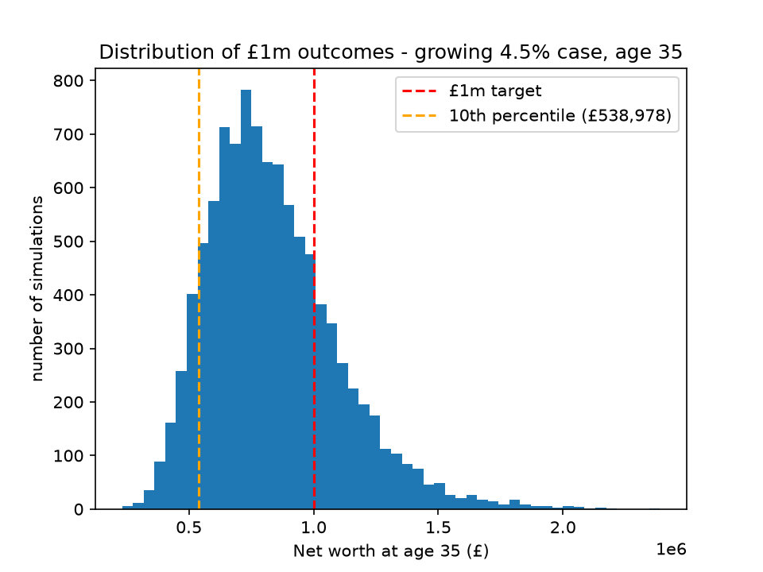

# Personal Finance Tracker

A Python tool that calculates net worth and asset split from live market data. 
I built it to replace a spreadsheet I was maintaining by hand in Excel.
The main goal was to have figures that automatically update themselves from 
the market rather than staying static after I typed them.

## What it does

- Reads my holdings (cash, equities, gold, metals) from a local spreadsheet
- Fetches live prices for the exchange-traded holdings via the yfinance library
- Converts USD-priced holdings into GBP using the live exchange rate
- Reports total net worth and a percentage breakdown by asset class

## Project structure

- `main.py` - entry point: loads holdings, fetches prices, reports net worth and allocation
- `prices.py` - fetches live prices and the GBP/USD exchange rate
- `holdings.py` - loads holdings from the spreadsheet
- `monte_carlo.py` - the simulation engine 
- `app.py` - interactive Streamlit dashboard over the model

## Running it

Install the dependencies:

    pip install -r requirements.txt

The program reads a file called `tracker.xlsx`, which is kept out of this
repository because it holds personal financial data. 
An included `sample_tracker.xlsx` has illustrative figures so the code runs out of the box. 
Make a copy of it, rename the copy to `tracker.xlsx`, then run:

    python main.py

## Notes

- Real holdings data is excluded via `.gitignore`; the committed sample uses fake numbers.
- config.json holds personal assumptions and is kept out of the repo, with the code using demo defaults
- Prices come from Yahoo Finance via yfinance and are delayed about 15–20 minutes.

## Built with

Python, pandas, yfinance, openpyxl, numpy, matplotlib, streamlit.

## £1M-by-35 Monte Carlo

A simulation that runs 10,000 market paths to estimate the probability of reaching a net-worth target by a given age, under different return and savings-growth assumptions.
It reports the probability of clearing the target and the downside (10th percentile) outcome.

## Interactive dashboard

A Streamlit dashboard wraps the projection model: sliders for the expected return, volatility and contribution growth drive the simulation live. 
The probability of reaching £1M by ages 35, 36 and 37, as well as the full distribution of outcomes, is recalculated whenever a slider is changed.

    streamlit run app.py